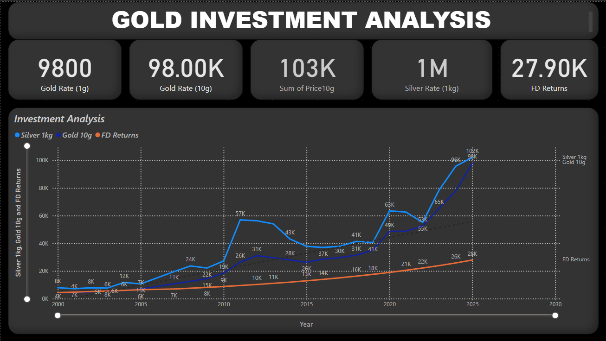

# Gold Investment Analysis 📈✨

This project provides a visual analysis of gold, silver, and fixed deposit (FD) investments over the past two decades.

## 🔍 Overview

The dashboard screenshot included in this repository compares:

- 📊 **Gold (10g)** prices
- ⚪ **Silver (1kg)** prices
- 🏦 **Fixed Deposit (FD)** returns

These trends are analyzed from the year 2000 up to 2025 to help visualize and compare long-term investment returns.

## 📌 Key Insights

- 🥇 Gold (10g) saw a maximum price of ₹98,000.
- 🥈 Silver (1kg) reached a peak of ₹102,000.
- 💰 Fixed Deposits offered slower, steady growth with a max return of ₹27,900.

## 📷 Dashboard Preview

## 🛠️ Tools Used

- Power BI for data visualization
- Historical price data sourced from public financial archives

---

> 📁 Feel free to fork, contribute, or suggest improvements!
